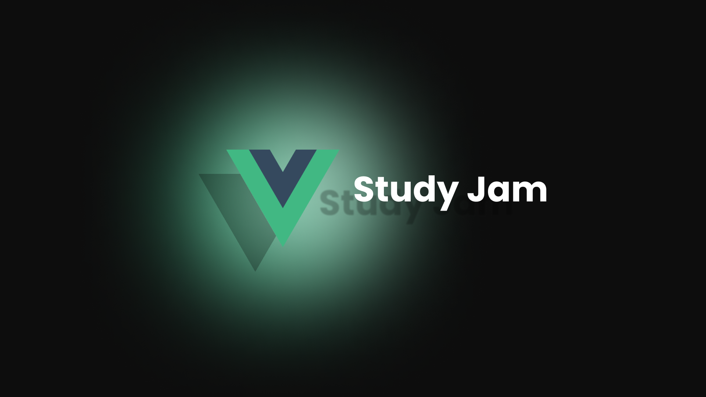

# Vue Study Jam

Welcome to the Vue Study Jam! This study jam is designed to help you learn Vue.js and build awesome web applications. Below are some resources that you may find helpful:

## Progress till now....

#### Excercise 1

Fav movie/anime/series ola characters list - form for adding characters - A section for faviortie list - a button for adding characters to faviortie list

## Some VScode Extensions

[Extension Pack](https://marketplace.visualstudio.com/items?itemName=mubaidr.vuejs-extension-pack) 🚀

## Documentation

- [Vue.js Official Documentation](https://vuejs.org/) - The official documentation for Vue.js. It provides a comprehensive guide to understanding and using Vue.js. 📚

## Packages

- [Vue Router](https://router.vuejs.org/) - The official router for Vue.js. It allows you to create single-page applications with client-side routing. 🚦

- [Vuex](https://vuex.vuejs.org/) - The official state management library for Vue.js. It helps you manage the state of your application in a predictable way. 🗃️

- [Pinia](https://pinia.vuejs.org/) - Pinia - The intuitive store for Vue.js - Type Safe, Extensible, and Modular by design. Forget you are even using a store. 🛍️

## Repositories

- [Vue CLI](https://github.com/vuejs/vue-cli) - The official command-line interface for Vue.js. It provides a set of tools for scaffolding and managing Vue.js projects. ⚙️

- [Awesome Vue](https://github.com/vuejs/awesome-vue) - A curated list of awesome Vue.js libraries, resources, and projects. 🌟

## Examples

- [Vue.js Examples](https://vuejsexamples.com/) - A collection of Vue.js examples and demos to help you learn and explore different aspects of Vue.js. 💡

Feel free to explore these resources and use them to enhance your learning experience. Happy coding! 👩‍💻👨‍💻
